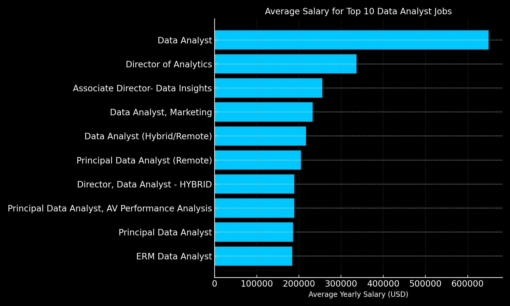
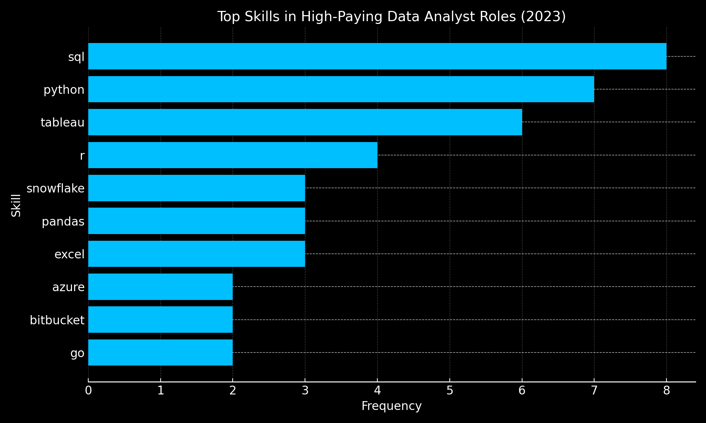

# Introduction
Welcome to my SQL Portfolio Project, where I explore the data job market with a focus on data analyst roles. This project is a personal deep dive into uncovering the highest-paying opportunities, the most in-demand skills, and where these two factors intersect within the field of data analytics.

Using real-world job posting data, I aimed to answer key questions that could guide my career development—and provide insights valuable to anyone entering the data field.

🔗 Check out the SQL queries here: [Project_SQL](/Project_SQL/)
# Background
📚 This project was driven by my goal to better understand the data analyst job market. I wanted to uncover which skills are both highly paid and in demand, helping me tailor my learning and job search more effectively.

The dataset used in this analysis comes from Luke Barousse’s SQL Course, and includes job postings with details such as job titles, salaries, locations, and required technical skills.

Through SQL queries, I set out to answer the following key questions:

- What are the highest-paying data analyst jobs?

- What skills are required for those top-paying roles?

- Which skills are most frequently requested in the job market?

- Which skills are linked to higher average salaries?

- What are the most valuable skills to learn for maximizing marketability as a data analyst?
# Tools I Used
In this project, I utilized a variety of tools to conduct my analysis:

- **SQL** (Structured Query Language): Enabled me to interact with the database, extract insights, and answer my key questions through queries.
- **PostgreSQL**: As the database management system, PostgreSQL allowed me to store, query, and manipulate the job posting data.
- **Visual Studio Code:** This open-source administration and development platform helped me manage the database and execute SQL queries.
- **Git & GitHub:** Essential for version control and sharing my SQL scripts and analysis, ensuring collaboration and project tracking
# The Analysis
Each query for this project aimed at investigating specific aspects of the data analyst job market. Here’s how I approached each question:

### 1. Top Paying Data Analyst Jobs

To identify the highest-paying roles, I filtered data analyst positions by average yearly salary and location, focusing on remote jobs. This query highlights the high paying opportunities in the field.

```sql
SELECT
    job_id,
    job_title,
    job_location,
    job_schedule_type,
    salary_year_avg,
    job_posted_date,
    name AS company_name
FROM
    job_postings_fact
LEFT JOIN company_dim
    ON job_postings_fact.company_id = company_dim.company_id
WHERE 
    job_title_short = 'Data Analyst' AND
    job_location = 'Anywhere' AND
    salary_year_avg IS NOT NULL
ORDER BY
    salary_year_avg DESC
LIMIT 10 
```
📊 Here's the breakdown from the above query:

- 💰 The highest-paying data analyst job offers a staggering salary of $650,000, listed by Mantys for a fully remote position.

- 🏢 High salaries aren’t limited to traditional analyst roles—titles like Director of Analytics and Associate Director - Data Insights also rank among the top, highlighting leadership as a key salary driver.

- 🌍 All top-paying roles are remote, suggesting that flexible work arrangements are common in high-compensation positions for data analysts.


*This chart shows the average salaries of the top 10 highest-paying remote data analyst jobs.*

### 2. Skills for Top Paying Jobs

To understand what skills are required for the top-paying jobs, I joined the job postings with the skills data, providing insights into what employers value for high-compensation roles.

```sql
-- Gets the top 10 paying Data Analyst jobs
WITH top_paying_jobs AS (
    SELECT
        job_id,
        job_title,
        salary_year_avg
    FROM
        job_postings_fact
    WHERE
        job_title_short = 'Data Analyst'
        AND salary_year_avg IS NOT NULL
        AND job_location = 'Anywhere'
    ORDER BY
        salary_year_avg DESC
    LIMIT 10
)
SELECT
    top_paying_jobs.job_id,
    top_paying_jobs.job_title,
    top_paying_jobs.salary_year_avg,
    skills_dim.skills
FROM
    top_paying_jobs
    INNER JOIN
    skills_job_dim ON top_paying_jobs.job_id = skills_job_dim.job_id
    INNER JOIN
    skills_dim ON skills_job_dim.skill_id = skills_dim.skill_id
ORDER BY
    top_paying_jobs.salary_year_avg DESC;
```

📊 Here's the breakdown from the above query:

-  SQL leads as the most frequently appearing skill in top-paying job listings, confirming its foundational importance in data analytics.

-  Python, Tableau, and R follow closely, highlighting the demand for both programming and visualization skills in well-compensated roles.

-  Cloud platforms like Snowflake and Azure, along with libraries like Pandas, also appear frequently—emphasizing the growing need for cloud and data engineering knowledge.



### 3. In-Demand Skills for Data Analysts

This query helped identify the skills most frequently requested in job postings, directing focus to areas with high demand.
```sql
SELECT
  skills_dim.skills,
  COUNT(skills_job_dim.job_id) AS demand_count
FROM
  job_postings_fact
  INNER JOIN
    skills_job_dim ON job_postings_fact.job_id = skills_job_dim.job_id
  INNER JOIN
    skills_dim ON skills_job_dim.skill_id = skills_dim.skill_id
WHERE
  job_postings_fact.job_title_short = 'Data Analyst'
GROUP BY
  skills_dim.skills
ORDER BY
  demand_count DESC
LIMIT 5;
```
📊 Here's the breakdown from the above query:
- SQL, Excel, and Python dominate the demand rankings, appearing in thousands of job postings—making them essential for aspiring data analysts.

- Visualization tools like Tableau and Power BI are also in high demand, highlighting the importance of communicating insights effectively in analytics roles.


| Skill     | Demand Count |
|-----------|--------------|
| SQL       | 7,291        |
| Excel     | 4,611        |
| Python    | 4,330        |
| Tableau   | 3,745        |
| Power BI  | 2,609        |
*Most In-Demand Skills for Data Analysts.*

### 4. Skills Based on Salary

Exploring the average salaries associated with different skills revealed which skills are the highest paying.
```sql
SELECT
  skills_dim.skills AS skill,
  ROUND(AVG(job_postings_fact.salary_year_avg),2) AS avg_salary
FROM
  job_postings_fact
INNER JOIN
  skills_job_dim ON job_postings_fact.job_id = skills_job_dim.job_id
INNER JOIN
  skills_dim ON skills_job_dim.skill_id = skills_dim.skill_id
WHERE
  job_postings_fact.job_title_short = 'Data Analyst'
  AND job_postings_fact.salary_year_avg IS NOT NULL
GROUP BY
  skills_dim.skills
ORDER BY
  avg_salary DESC;
```
📊 Here's the breakdown from the above query:

- Big Data and Cloud skills dominate: Tools like PySpark, Databricks, and GCP show that handling large, cloud-based datasets is critical for top-paying roles.

- Machine Learning skills boost salaries: Knowledge of frameworks like Datarobot, Scikit-learn, and Pandas suggests that predictive analytics and automation are highly valued.

- Engineering mindset is rewarded: Experience with developer tools (Gitlab, Kubernetes, Jenkins) and programming languages (Golang, Swift) signals higher earnings potential for data analysts.


| Skill      | Average Salary (USD) |
|------------|----------------------|
| PySpark    | $208,172             |
| Bitbucket  | $189,155             |
| Couchbase  | $160,515             |
| Watson     | $160,515             |
| DataRobot  | $155,486             |
*These are the highest-paying technical skills based on job listings, highlighting the value of advanced tools and platforms in securing top-tier data roles.*

### 5. Most Optimal Skills to Learn

Combining insights from demand and salary data, this query aimed to pinpoint skills that are both in high demand and have high salaries, offering a strategic focus for skill development.

```sql
WITH skills_demand AS (
  SELECT
    skills_dim.skill_id,
    skills_dim.skills,
    COUNT(skills_job_dim.job_id) AS demand_count
  FROM
    job_postings_fact
    INNER JOIN
    skills_job_dim ON job_postings_fact.job_id = skills_job_dim.job_id
    INNER JOIN
    skills_dim ON skills_job_dim.skill_id = skills_dim.skill_id
  WHERE
    job_postings_fact.job_title_short = 'Data Analyst'
    AND job_postings_fact.salary_year_avg IS NOT NULL
    AND job_postings_fact.job_location = 'Anywhere'
  GROUP BY
    skills_dim.skill_id
),
average_salary AS (
  SELECT
    skills_job_dim.skill_id,
    AVG(job_postings_fact.salary_year_avg) AS avg_salary
  FROM
    job_postings_fact
    INNER JOIN
    skills_job_dim ON job_postings_fact.job_id = skills_job_dim.job_id
  WHERE
    job_postings_fact.job_title_short = 'Data Analyst'
    AND job_postings_fact.salary_year_avg IS NOT NULL
    AND job_postings_fact.job_location = 'Anywhere'
  GROUP BY
    skills_job_dim.skill_id
)
SELECT
  skills_demand.skills,
  skills_demand.demand_count,
  ROUND(average_salary.avg_salary, 2) AS avg_salary
FROM
  skills_demand
  INNER JOIN
  average_salary ON skills_demand.skill_id = average_salary.skill_id
ORDER BY
  demand_count DESC,
  avg_salary DESC
LIMIT 10;
```
📊 Here's the breakdown from the above query:
- SQL, Excel, and Python rank highest in demand, making them essential tools for job security in the data analyst field.

- Among the top skills, Python, R, and Tableau also offer salaries above $99,000, reflecting strong financial value.

- These skils strike a balance between market demand and earning potential—making them the most strategic for aspiring or growing data analysts to prioritize.


| Skill   | Demand Count | Average Salary (USD) |
|---------|---------------|----------------------|
| SQL     | 398           | $97,237.16           |
| Excel   | 256           | $87,288.21           |
| Python  | 236           | $101,397.22          |
| Tableau | 230           | $99,287.65           |
| R       | 148           | $100,498.77          |
*Optimal Skills to Learn (High Demand + High Salary).*

# What I Learned

### This project allowed me to strengthen several essential SQL and analytical skills:

🧩 Complex Query Construction: Learned how to build advanced SQL queries by combining multiple tables and using WITH clauses (CTEs) for clearer logic and modularity.

📊 Data Aggregation: Gained experience with GROUP BY, COUNT(), AVG(), and SUM() to effectively summarize and analyze large datasets.

🧠 Analytical Thinking: Improved my ability to turn real-world business questions into actionable SQL queries that deliver insightful answers.
# Insights
### From the analysis, several key insights emerged:

💰 Top-Paying Data Analyst Jobs: Remote roles offer a wide salary range, with the highest reaching $650,000, highlighting the earning potential in flexible positions.

🛠️ Skills for Top-Paying Jobs: Advanced proficiency in SQL consistently appears in top-paying roles, underscoring its value in securing high compensation.

📈 Most In-Demand Skills: SQL leads in demand across job postings, making it a must-have for anyone entering or advancing in the data analyst field.

💎 Skills with Higher Salaries: Niche skills like SVN and Solidity command the highest average salaries, showing that specialization can lead to financial advantage.

🎯 Optimal Skills for Market Value: Skills such as SQL, Python, and Tableau rank high in both demand and salary, making them strategic choices for maximizing job opportunities and earnings.
# Conclusions
This project significantly strengthened my SQL skills and offered valuable insights into the evolving data analyst job market. The analysis serves as a strategic guide for prioritizing both skill development and targeted job searching.

For aspiring data analysts, focusing on high-demand and high-paying skills—like SQL, Python, and Tableau—can lead to stronger positioning in a competitive landscape. Overall, this project reinforced the importance of continuous learning and staying adaptable to new tools and trends in the ever-changing field of data analytics. 🚀

